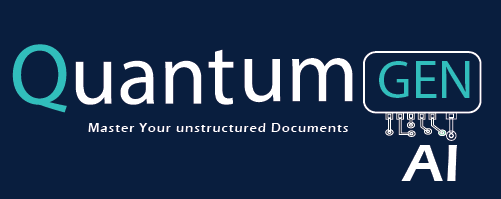

# Quantum Gen AI

Quantum Gen AI (Enterprise Gen AI), is a cutting-edge solution meticulously crafted to handle unstructured data in diverse formats, catering to a wide range of practical applications. Below are its key functionalities:

- It performs Optical Character Recognition (OCR) to extract text.
- It generates text summarization.
- It retrieves the most similar documents from a database based on the document's topic.
- It creates network graphs with named entity recognition.
- It provides document recommendations.
- Provides the predicted domain using Quantum ML


        


      QuantumGenAi
      ├─ utils
      │  ├─ ocr_utils.py
      │  ├─ translation_utils.py
      │  ├─ summarization_utils.py
      │  ├─ ner_utils.py
      │  ├─ graph_utils.py
      │  ├─ gpt_utils.py
      │  ├─ prepare_quantum.py
      │  └─ quantum.py
      │
      ├─ components
      │  ├─ ner_component.py
      │  └─ similarity.py
      │
      ├─ data
      │  └─ output.csv
      │
      ├─ main.py
      ├─ config.py
      ├─ requirements.txt
      ├─ requirements_quantum.txt
      └─ README.md            

   
 ## Technolgies


- OpenAI
- Pytesseract 
- Langchain / LamaIndex
- Networkxx
- Quantum Machine learning
- Transformers (Hugging face)


    


## Installation

To set up the project, follow these steps:

1. Clone the repository:

   ```bash
   git clone <repository_URL>
   

2. Install the required Python packages by running:
    
   ```bash
   pip install -r requirements.txt

3. Install the required Python packages by running:

   ```bash
    pip install -r requirements_quantum.txt

4. Run the application using Streamlit:

   ```bash
   streamlit run main.py
   
**PS:** Use python 3.8 to deploy on streamlit cloud

## Next Milestone


- Vector Database Implementation: Leverage vector databases to enhance the efficiency and accessibility of data storage and retrieval within the QuantumGen AI framework.

- Utilizing Open Source Large Language Models: Integrate state-of-the-art large language models from open-source repositories to enrich the language understanding capabilities of QuantumGen AI.

- Quantum Computing for Domain Prediction: Elevate prediction accuracy by transitioning from conventional simulators to actual quantum computers, unlocking the true potential of quantum processing for domain prediction.

- Multilingual Support: Extend QuantumGen AI's capabilities to comprehend and process information across multiple languages, fostering a more inclusive and globally applicable solution.

- Dashboard for Insightful Representations: Develop a user-friendly dashboard for visually representing and interpreting insights extracted by QuantumGen AI, facilitating intuitive comprehension of complex data patterns.
